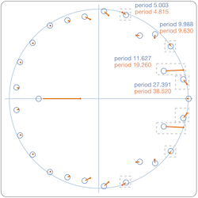
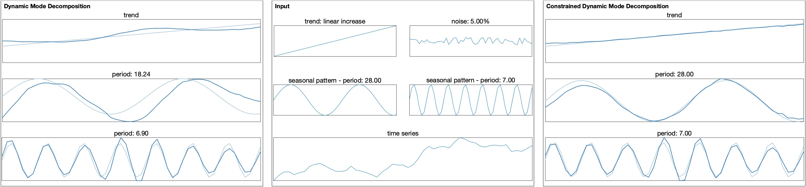
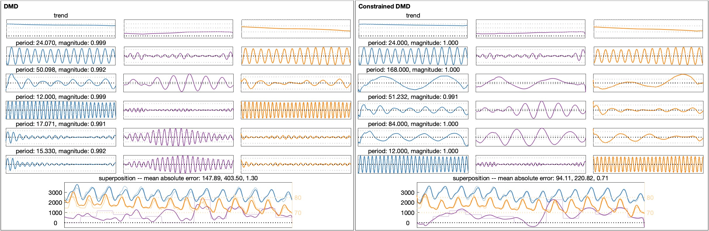

<h1 align="center">Constrained Dynamic Mode Decomposition</h1>

## ✨ Overview
This repository provides the code for **Constrained Dynamic Mode Decomposition** (Constrained DMD) by Krake et al. [[1]](#1). It describes the main method and additional visualization techniques as well as replications of several figures of the paper.

The content is as follows: 

    │
    ├── datasets
    │   ├── artificial.mat       # Self-made
    │   ├── hourly_data.txt      # Available on www.caiso.com or see github.com/pratha19/Hourly_Energy_Consumption_Prediction 
    │   └── lynx.mat 	     # Lynx dataset, see [2]
    ├── figures	
    │   ├── Fig01.jpg	     # Example figure for Fig. 1   
    │   └── Fig10.jpg	     # Example figure for Fig. 10		
    ├── replication             
    │   ├── replication_fig_1.m
    │   ├── replication_fig_10.m
    │   └── ...
    ├── toolbox    
    │   ├── DMD_***.m            # Core of Constrained DMD    
    │   ├── VIS_***.m            # Visualization techniques     
    │   ├── TOOL_***.m           # Miscellaneous functions 
    │   └── IO_***.m             # Input/Output
    └── main_demo_lynx.m	     # Main demo for the human-in-the-loop method of Constrained DMD (regarding the lynx dataset)

## ⚙️ Usage
This code was tested with MATLAB2022a.

Main functionality can be accessed via the function in the toolbox `DMD_ConstrainedDMD`:

```Matlab
DMDOrig = DMD_ConstrainedDMD(DATA);

DMDCons = DMD_ConstrainedDMD(DATA, DMDOrig, constraints);
```
This function `DMD_ConstrainedDMD` implements the method **Constrained Dynamic Mode Decomposition**. The method is described in Algorithm 1 in more detail in the related publication [[1]](#1). Depending on the number of inputs, this function either computes original DMD (one input) or Constrained DMD (three inputs) incorporating `constraints` into the original decomposition with DMD `DMDOrig`.

A demo of Constrained DMD applied to the lynx dataset [[2]](#2) (see Figure 7, 8, and 9 in the related publication) is described in `main_demo_lynx.m`. The lynx dataset is an univariate time series that consists of seasonal and cyclic patterns. These patterns are characterized by a non-integer period given by 9.63. In this demo, the core method, the visualization techniques, and the human-in-the-loop procedure is illustrated.


<h2 align="left"> Replication of Results</h2>

The replication folder consists of files that aim to reproduce visualizations from the related publication [[1]](#1). The replication of the teaser (Fig. 1), which is based on the dataset `artificial.mat`, can be done with the file `replication_fig_1.m`:



Furthermore, the replication of Fig. 10, which is based on the dataset `hourly_data.txt`, can be done with the file `replication_fig_10.m`:




## 📖 References
<a id="1">[1]</a> 
T. Krake, D. Klötzl, B. Eberhardt, and D. Weiskopf,
"Constrained Dynamic Mode Decomposition",
In: IEEE Transactions on Visualization and Computer Graphics, 2022,
doi: [https://doi.org/10.1109/TVCG.2022.3209437].

```
@article{krake2022ConstrainedDMD,
  title={Constrained Dynamic Mode Decomposition},
  author={Krake, Tim and Klötzl, Daniel and Eberhardt, Bernhard and Weiskopf, Daniel},
  journal={IEEE Transactions on Visualization and Computer Graphics},  
  year={2022},
  volume={},
  number={},
  pages={1-11},
  doi={10.1109/TVCG.2022.3209437}
  }
```

<a id="2">[2]</a> 
Brockwell, P. J. and Davis, R. A.,
"Time Series and Forecasting Methods",
In: Second edition. Springer. Series G,
page 557, 1991.


## 👤 Authors
**Tim Krake** and **Daniel Klötzl**

- Github: [@kraketm](https://github.com/kraketm)
- Github: [@visdan93](https://github.com/visdan93)


## License
Copyright 2022 Tim Krake & Daniel Klötzl

Licensed under the Apache License, Version 2.0 (the "License");
you may not use this file except in compliance with the License.
You may obtain a copy of the License at

   http://www.apache.org/licenses/LICENSE-2.0

Unless required by applicable law or agreed to in writing, software
distributed under the License is distributed on an "AS IS" BASIS,
WITHOUT WARRANTIES OR CONDITIONS OF ANY KIND, either express or implied.
See the License for the specific language governing permissions and
limitations under the License.
